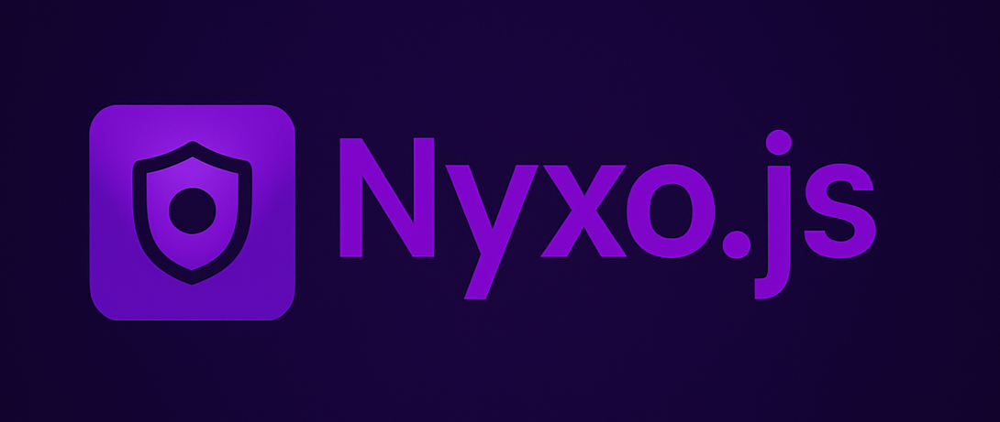

  <h1>🎵 @nyxojs/opus</h1>
  <h3>Enterprise-Grade Opus Audio Codec for Discord Voice Applications</h3>

  

    
    
    
    
  

   
  

## 🚀 About

`@nyxojs/opus` is a high-performance Opus audio codec library specifically optimized for Discord Voice applications.
Built with modern C++ and TypeScript, it provides enterprise-grade audio encoding/decoding capabilities with a focus on
low latency, high throughput, and minimal resource usage.

> [!NOTE]
> This package is part of the Nyxo.js ecosystem but can be used independently in any Discord bot or Node.js application
> requiring high-performance Opus audio processing.

## ⚠️ Project Status

> [!IMPORTANT]
> **Current Status: Beta Development**  
> This project is in active development. The core functionality is stable and ready for testing, but breaking changes
> may still occur before the stable release.

## 📜 License

This package is [Apache 2.0 licensed](LICENSE).
